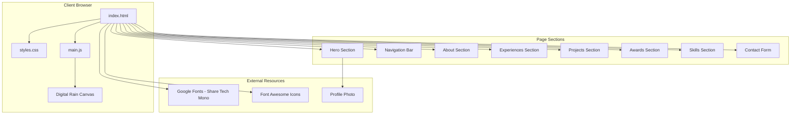

# Design Document: B4Y0N3TTA Portfolio

## Overview

B4Y0N3TTA is a Matrix-themed personal portfolio website for John Raven Unera (Rae), a cybersecurity enthusiast and programmer. The website delivers an immersive experience through digital rain animations, neon green aesthetics, and high-level visual effects while showcasing Rae's experiences, projects, awards, and skills.

The portfolio is built as a single-page application using vanilla HTML, CSS, and JavaScript to ensure fast loading, easy deployment, and no framework dependencies. The Matrix theme is achieved through a combination of HTML5 Canvas for the digital rain background, CSS animations for glitch and glow effects, and JavaScript for interactive elements.

## Architecture



### Technology Stack

- **HTML5**: Semantic markup with Canvas API for digital rain
- **CSS3**: Custom properties, animations, flexbox, grid, media queries
- **JavaScript (ES6+)**: DOM manipulation, Intersection Observer API, Canvas rendering
- **Fonts**: Share Tech Mono (primary), monospace fallback
- **Icons**: Font Awesome for social media icons

## Components and Interfaces

### 1. Digital Rain Background (Canvas)

```javascript
interface DigitalRainConfig {
  canvas: HTMLCanvasElement;
  fontSize: number;        // Default: 14px
  columns: number;         // Calculated from canvas width
  drops: number[];         // Y position for each column
  characters: string;      // "01" for binary
  color: string;           // "#00FF41" Matrix green
  fadeColor: string;       // "rgba(0, 0, 0, 0.05)" for trail effect
}

interface DigitalRainRenderer {
  init(): void;
  draw(): void;
  resize(): void;
  start(): void;
  stop(): void;
}
```

### 2. Navigation Component

```javascript
interface NavigationConfig {
  logo: HTMLElement;
  links: NodeList;
  hamburger: HTMLElement;
  mobileMenu: HTMLElement;
  scrollThreshold: number;  // Pixels before background appears
}

interface NavigationController {
  init(): void;
  handleScroll(): void;
  toggleMobileMenu(): void;
  smoothScrollTo(sectionId: string): void;
}
```

### 3. Animation Controller

```javascript
interface AnimationConfig {
  glitchElements: NodeList;
  typewriterElements: NodeList;
  fadeElements: NodeList;
  observerOptions: IntersectionObserverInit;
}

interface AnimationController {
  init(): void;
  setupIntersectionObserver(): void;
  triggerGlitch(element: HTMLElement): void;
  triggerTypewriter(element: HTMLElement, text: string, speed: number): void;
  triggerFadeIn(element: HTMLElement): void;
}
```

### 4. Contact Form Handler

```javascript
interface FormData {
  name: string;
  email: string;
  subject: string;
  message: string;
}

interface ValidationResult {
  isValid: boolean;
  errors: Map<string, string>;
}

interface ContactFormController {
  init(): void;
  validate(data: FormData): ValidationResult;
  submit(data: FormData): Promise<void>;
  showError(field: string, message: string): void;
  showSuccess(): void;
  clearForm(): void;
}
```

### 5. Project Card Component

```javascript
interface ProjectData {
  name: string;
  description: string;
  tags: string[];
}

interface ProjectCardController {
  init(card: HTMLElement): void;
  handleMouseMove(event: MouseEvent): void;
  handleMouseLeave(): void;
  applyTiltEffect(x: number, y: number): void;
}
```

## Data Models

### Content Data Structure

```javascript
const portfolioData = {
  personal: {
    title: "B4Y0N3TTA",
    name: "John Raven Unera",
    nickname: "Rae",
    photo: "assets/profile.jpg",
    about: "Hello World! I am Raven, you may call me Rae..."
  },
  
  social: {
    github: "https://github.com/raethemenace",
    linkedin: "https://www.linkedin.com/in/john-raven-unera-728736356/",
    instagram: "https://www.instagram.com/gnx.rae"
  },
  
  experiences: [
    {
      title: "International Battle Of Hackers 2025",
      host: "APU Malaysia",
      rank: "17/42",
      type: "International"
    },
    {
      title: "HackForGov 2025",
      region: "National Capital Region",
      rank: "7/20",
      type: "National"
    },
    {
      title: "IT Quiz Bee",
      rank: "2nd Place",
      type: "Academic"
    }
  ],
  
  projects: [
    {
      name: "HYDRA",
      description: "A unified OSINT and HUMINT Platform against corruption."
    },
    {
      name: "HarvesTrace",
      description: "An ERP and Traceability System for farmers."
    },
    {
      name: "KainTeen",
      description: "A click-to-order platform for students with basic ERP functionalities for canteen processes."
    }
  ],
  
  awards: [
    {
      title: "Dean's Lister",
      period: "1st Semester S.Y. 2024-2025"
    },
    {
      title: "Dean's Lister",
      period: "2nd Semester S.Y. 2024-2025"
    },
    {
      title: "C2 Proficient",
      issuer: "EFSET English Certification Exam"
    }
  ],
  
  skills: {
    technical: [
      "Kali Linux OS",
      "OSINT (theHarvester, Sherlock)",
      "Intermediate Cryptography (Hashcat, JohnTheRipper)",
      "Web Development (HTML, CSS, JSX, React, Tailwind, PHP)",
      "MySQL"
    ],
    soft: [
      "English Language Proficiency",
      "Team Leader",
      "Adaptability",
      "Hosting/Presenting",
      "Visionary",
      "Punctual"
    ]
  }
};
```

### CSS Design Tokens

```css
:root {
  /* Colors */
  --matrix-green: #00FF41;
  --matrix-green-dim: #00CC33;
  --matrix-green-glow: rgba(0, 255, 65, 0.5);
  --bg-primary: #0D0D0D;
  --bg-secondary: #1A1A1A;
  --bg-card: rgba(26, 26, 26, 0.8);
  --text-primary: #00FF41;
  --text-secondary: #CCCCCC;
  --error-red: #FF0040;
  --error-glow: rgba(255, 0, 64, 0.5);
  
  /* Typography */
  --font-primary: 'Share Tech Mono', monospace;
  --font-size-xs: 0.75rem;
  --font-size-sm: 0.875rem;
  --font-size-base: 1rem;
  --font-size-lg: 1.25rem;
  --font-size-xl: 1.5rem;
  --font-size-2xl: 2rem;
  --font-size-3xl: 3rem;
  --font-size-hero: 4rem;
  
  /* Spacing */
  --spacing-xs: 0.25rem;
  --spacing-sm: 0.5rem;
  --spacing-md: 1rem;
  --spacing-lg: 2rem;
  --spacing-xl: 4rem;
  --spacing-section: 6rem;
  
  /* Effects */
  --transition-fast: 150ms ease;
  --transition-normal: 300ms ease;
  --transition-slow: 500ms ease;
  --neon-glow: 0 0 10px var(--matrix-green), 0 0 20px var(--matrix-green), 0 0 30px var(--matrix-green-glow);
  --neon-glow-subtle: 0 0 5px var(--matrix-green), 0 0 10px var(--matrix-green-glow);
  
  /* Breakpoints (for reference) */
  --breakpoint-sm: 320px;
  --breakpoint-md: 768px;
  --breakpoint-lg: 1024px;
  --breakpoint-xl: 1280px;
}
```

## Error Handling

### Form Validation Errors

| Error Type | Condition | User Feedback |
|------------|-----------|---------------|
| Empty Name | name.trim() === '' | "Name is required" with red glow |
| Invalid Email | !email.match(emailRegex) | "Please enter a valid email" with red glow |
| Empty Subject | subject.trim() === '' | "Subject is required" with red glow |
| Empty Message | message.trim() === '' | "Message is required" with red glow |
| Submission Success | All fields valid | "Message sent successfully!" with green glow |

### Animation Fallbacks

- If `prefers-reduced-motion` is enabled, disable complex animations
- If Canvas is not supported, fall back to CSS gradient background
- If Intersection Observer is not supported, show all elements immediately

### Responsive Breakpoint Handling

| Breakpoint | Layout Changes |
|------------|----------------|
| < 768px | Single column, hamburger menu, reduced animations |
| 768px - 1023px | Two-column grid, full navigation |
| ≥ 1024px | Full desktop layout, all animations enabled |


## Correctness Properties

*A property is a characteristic or behavior that should hold true across all valid executions of a system-essentially, a formal statement about what the system should do. Properties serve as the bridge between human-readable specifications and machine-verifiable correctness guarantees.*

Based on the acceptance criteria analysis, the following properties must hold for the portfolio website:

### Property 1: Navigation Link Scroll Target Consistency

*For any* navigation link in the Navigation_Bar, clicking that link SHALL scroll the viewport to the section whose ID matches the link's href attribute.

**Validates: Requirements 2.4**

### Property 2: Experience Chronological Ordering

*For any* list of experiences rendered in the Experiences section, the experiences SHALL be ordered such that each experience's date is greater than or equal to the date of the experience that follows it (reverse chronological order).

**Validates: Requirements 4.1**

### Property 3: Project Card Content Completeness

*For any* project card rendered in the Projects section, the card SHALL contain both a non-empty project name element and a non-empty description element.

**Validates: Requirements 5.2**

### Property 4: Form Validation Error Display

*For any* required form field (name, email, subject, message) that is empty or invalid when the form is submitted, the Contact_Form SHALL display a corresponding error message and apply error styling to that field.

**Validates: Requirements 8.2**

### Property 5: Responsive Typography Scaling

*For any* viewport width between 320px and 1280px, the base font size SHALL scale proportionally within the range of 14px to 18px, maintaining readability across all breakpoints.

**Validates: Requirements 9.4**

### Property 6: Hover Transition Timing

*For any* interactive element (buttons, cards, links) with hover effects, the CSS transition duration SHALL be less than or equal to 300 milliseconds.

**Validates: Requirements 10.3**

## Testing Strategy

### Unit Testing

Unit tests will verify specific examples and edge cases:

- Hero section renders with correct title and name
- All navigation links are present and have correct hrefs
- All three projects are displayed with correct data
- All experiences are displayed
- All awards are displayed
- All skills (technical and soft) are displayed
- Contact form fields exist and are properly labeled
- Social media links have correct URLs

### Property-Based Testing

Property-based tests will use **fast-check** library for JavaScript to verify universal properties:

- **Property 1**: Generate random navigation link clicks and verify scroll targets match
- **Property 2**: Generate random experience data and verify ordering is maintained
- **Property 3**: Generate random project data and verify all cards have required content
- **Property 4**: Generate random form submissions with various empty/invalid fields and verify error handling
- **Property 5**: Generate random viewport widths and verify font scaling
- **Property 6**: Verify all interactive elements have transition durations ≤ 300ms

Each property-based test will:
- Run a minimum of 100 iterations
- Be tagged with the format: `**Feature: matrix-portfolio, Property {number}: {property_text}**`
- Reference the specific correctness property from this design document

### Integration Testing

- Full page load and render verification
- Scroll behavior across all sections
- Mobile responsive behavior at breakpoints
- Form submission flow (validation → success/error)

### Accessibility Testing

- Color contrast ratios meet WCAG AA standards
- Keyboard navigation works for all interactive elements
- Screen reader compatibility for content sections
- Reduced motion preference is respected

## File Structure

```
portfolio/
├── index.html              # Main HTML file with all sections
├── css/
│   └── styles.css          # All styles including animations
├── js/
│   ├── main.js             # Main initialization and controllers
│   ├── digital-rain.js     # Canvas-based digital rain animation
│   ├── animations.js       # Glitch, typewriter, fade effects
│   ├── navigation.js       # Navigation and scroll handling
│   └── contact-form.js     # Form validation and submission
├── assets/
│   ├── profile.jpg         # Rae's profile photo
│   └── logo.svg            # Matrix-themed B4Y0N3TTA logo
└── tests/
    ├── unit/
    │   └── portfolio.test.js
    └── property/
        └── portfolio.property.test.js
```

## Implementation Notes

### Digital Rain Performance Optimization

- Use `requestAnimationFrame` for smooth 60fps animation
- Implement column-based rendering to minimize draw calls
- Use `willChange: transform` CSS hint for hardware acceleration
- Throttle resize event handlers with debouncing

### Accessibility Considerations

- Ensure all text has minimum 4.5:1 contrast ratio against dark background
- Provide `aria-labels` for icon-only buttons
- Implement keyboard focus indicators with neon glow
- Support `prefers-reduced-motion` media query

### Logo Design

The B4Y0N3TTA logo will feature:
- Monospace typography with Matrix-style characters
- Subtle glitch animation on hover
- Neon green glow effect
- SVG format for scalability
